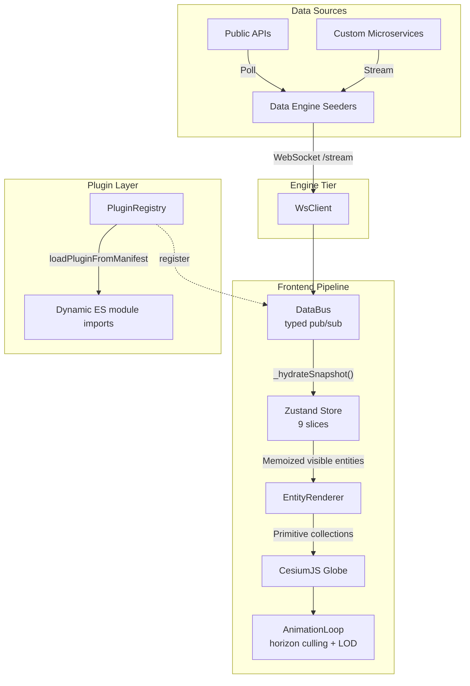

# Architecture

WorldWideView is a **real-time geospatial intelligence engine**: a Next.js 16 frontend that renders live global data on a CesiumJS 3D globe, fed by a network of independent data seeders streaming over WebSockets. The whole platform is built on an "All-Bundle" plugin architecture, so data sources are decoupled from the core viewer and can be added, removed, or hot-swapped without touching rendering code.

This document is the deep-dive companion to the [README](../README.md). It is intended for human contributors who want to understand how the pieces fit before opening their first PR. For agent-facing rules and conventions, see [`AGENTS.md`](../AGENTS.md) at the repo root and the documents under [`.agents/rules/`](../.agents/rules/).

## System Overview



The strict unidirectional flow — engine → bus → store → renderer — is what lets the system push sub-second updates for thousands of entities without React render-cycle bottlenecks.

## Plugin System (Core Abstraction)

Every data source in WorldWideView is a **plugin** implementing the `WorldPlugin` interface from [`@worldwideview/wwv-plugin-sdk`](../packages/wwv-plugin-sdk/). The plugin's lifecycle plugs into a real-time WebSocket firehose:

```text
PluginRegistry.register() → PluginManager.registerPlugin()
  → plugin.initialize(context)

Visibility Toggle → DataBusSubscriber subscribes to layer via WsClient
  → Engine responds with instantaneous WebSocket snapshots over /stream
  → WsClient pipes to DataBus.emit("dataUpdated", WsStreamPayload)
  → Store → EntityRenderer → Globe
```

Four plugin architectures coexist under the "All-Bundle Model":

1. **Data Engine Seeder** — A lightweight `seeder.mjs` script run by the dynamic `wwv-data-engine` runner. (Previously a standalone microservice container; the runner replaces that.)
2. **Dynamic CDN Loaded (Bundle)** — Externally developed plugins, dynamically imported at runtime via ES module CDNs (e.g. version-pinned `unpkg.com` URLs).
3. **Static Compiled (Bundle)** — Static GeoJSON data wrapped into JS bundles via `wwvStaticCompiler` during build/sync. (Previously `StaticDataPlugin`.)
4. **Active Proxied (Bundle)** — Next.js API routes bundled to mediate frontend interactions. (Previously `DeclarativePlugin`.)

All four are now dynamically imported at runtime as ES module bundles via `loadPluginFromManifest`, which uses `import(/* webpackIgnore: true */ entry)`. The legacy `StaticDataPlugin` and `DeclarativePlugin` runtimes are fully deprecated.

> [!IMPORTANT]
> Plugin types are re-exported from the SDK through `src/core/plugins/PluginTypes.ts` and `src/core/plugins/PluginManifest.ts`. The **source of truth is always `@worldwideview/wwv-plugin-sdk`** — never define plugin types locally.

For the contributor checklist when authoring a plugin, see [`.agents/skills/worldwideview-plugin-creation/`](../.agents/skills/) and the [Plugin Quickstart](plugin-quickstart.md).

## State Management

WorldWideView uses a Zustand store split into **nine slices**, each in its own file under [`src/core/state/`](../src/core/state/):

| Slice | Responsibility |
|---|---|
| `globe` | Camera position, imagery layers, scene settings |
| `layers` | Per-plugin visibility toggles |
| `timeline` | Playback range, current time, play/pause |
| `ui` | Panel open/closed states, selected entity |
| `filter` | Plugin filter expressions, applied via `filterEngine` |
| `data` | Entity cache (`entitiesByPlugin`), websocket connection state |
| `config` | Plugin settings, polling intervals, API keys |
| `favorites` | User-bookmarked entities |
| `geojson` | Custom GeoJSON overlays |

Access patterns:

- React components: `const camera = useStore((s) => s.camera);`
- Outside React (animation loop, hooks setup): `const state = useStore.getState();`
- Plugin settings: `configSlice.dataConfig.pluginSettings[pluginId]`
- Polling intervals: `configSlice.dataConfig.pollingIntervals[pluginId]`

The animation loop deliberately snapshots state once per frame via `getState()` rather than subscribing — `requestAnimationFrame` is the loop driver, so adding a Zustand subscription would just duplicate ticks.

## Data Pipeline

Real-time data follows a strict unidirectional path optimised for sub-second updates:

```text
Engine push /stream → DataBusSubscriber WsClient router
  → WsClient.handleMessage() → DataBus.emit("websocketData", WsStreamPayload)
  → DataBusSubscriber → _hydrateSnapshot() → Store.entitiesByPlugin
  → GlobeView (memoised visible entities)
  → EntityRenderer (billboard/point primitives)
  → AnimationLoop (horizon culling, hover/selection)
  → StackManager (co-located entity grouping)
```

The `DataBus` is a custom typed pub/sub singleton (see [`src/core/data/DataBus.ts`](../src/core/data/DataBus.ts)). It exists specifically to bypass React's render cycle for high-frequency events — store updates are batched into the Zustand store, but raw stream events ride the bus directly.

## Data Engine & Seeders

The data engine ([`wwv-data-engine`](https://github.com/silvertakana/wwv-data-engine), public) is a **content-agnostic runner**. It discovers and executes seeder scripts from a configurable directory; the engine itself knows nothing about specific data sources.

- **Local development**: The engine runs via Docker Compose on port 5001, reading seeders dynamically from `local-seeders/` (split into `community` and `private` tiers).
- **Production**: The engine container on Coolify downloads release bundles from `wwv-seeders-community` and `wwv-seeders-private` on startup, unzipping them into `/app/seeders`.
- **Split-routing**: `resolveEngineUrl` prioritises the local dev engine (`ws://localhost:5001/stream`) for local testing — 12-Factor App methodology — and falls back to cloud-hosted endpoints (e.g. `wss://dataenginev2.worldwideview.dev/stream`) when nothing local is available.

### Agnostic Frontend

WorldWideView's frontend is a **completely agnostic renderer**. It has no concept of a "unified" data engine. If 30 plugins each declare a different `streamUrl`, the application opens 30 WebSocket connections; it just so happens that the default plugin set shares `wwv-data-engine`, but the platform is 100% decentralised.

> [!IMPORTANT]
> Each plugin is a self-contained package and **MUST explicitly declare its own `streamUrl` in its manifest or config.** Do not assume the frontend acts as a unified pipe.

### Dual-Output Engine

Each seeder automatically exposes both a WebSocket stream (`/stream`) and a REST API endpoint (`/api/[plugin-id]`). Plugins can consume either depending on their data shape — bursty / live → stream, slow-moving / on-demand → REST.

### Scope Boundary (the 99 / 1 Rule)

The engine handles standard caching and broadcasting — the 99% case. Plugins that require complex on-demand compute (the 1%) must host their own custom backend; the engine intentionally does not grow features for them.

## Rendering Pipeline

The renderer is where most of WorldWideView's engineering depth lives. Three design choices drive the performance envelope:

### Primitive-based rendering

We use [`PointPrimitiveCollection`](https://cesium.com/learn/cesiumjs/ref-doc/PointPrimitiveCollection.html), `BillboardCollection`, `LabelCollection`, and `PolylineCollection` directly — **not** the Cesium Entity API. The Entity API is convenient but allocates per-entity ECS-style state that gets expensive past a few thousand entities. Primitive collections batch their state into typed GPU buffers, so 10k+ live entities still hold 60 fps on a moderate laptop.

Collections are tracked per-viewer via a module-level `WeakMap<CesiumViewer, PrimitiveCollections>` in [`src/core/globe/EntityRenderer.ts`](../src/core/globe/EntityRenderer.ts), keeping the renderer multi-viewer-capable and ensuring collections GC cleanly when a viewer is torn down.

### Chunked processing

Large datasets (10k+ entities) are rendered via [`ChunkedProcessor`](../src/core/globe/ChunkedProcessor.ts) in 500-entity chunks across multiple microtasks, so adding a new plugin layer never blocks the main thread long enough to drop a frame.

### Horizon culling and LOD

The animation loop performs **manual horizon culling** in [`AnimationLoop.ts`](../src/core/globe/AnimationLoop.ts) using a single dot-product against the Earth radius — much cheaper than depth-testing thousands of primitives every frame, and tunable for "entities just below the horizon should still be visible" semantics that depth-testing can't express.

Entities of `type: "model"` are promoted to full 3D glTF models at close range via the LOD system in [`useModelRendering.ts`](../src/core/globe/hooks/useModelRendering.ts) — so an aircraft at 50 nm range is a tinted billboard, but at 5 nm it's a textured plane model with the right wing geometry.

### Stack / Spiderifier

When multiple entities share a screen-space cluster (busy ports, busy airspaces), [`StackManager`](../src/core/globe/StackManager.ts) groups them and [`stackAnimation`](../src/core/globe/stackAnimation.ts) handles the spiderification expansion when a stack is clicked.

### Entity-type rules

> [!WARNING]
> When returning `CesiumEntityOptions` from a plugin's `renderEntity()`:
>
> - **Points**: Use `type: "point"` with `color`, `size`, `outlineColor`, `outlineWidth`.
> - **Billboards**: Use `type: "billboard"` with `iconUrl`, `color`, `iconScale`.
> - **NEVER mix**: Do not set `size` / `outlineWidth` / `outlineColor` on a billboard — Cesium silently clips the GPU upload and the icon disappears.

## Edition System

WorldWideView ships in three editions, controlled by the `NEXT_PUBLIC_WWV_EDITION` environment variable. Feature flags are derived from this in [`src/core/edition.ts`](../src/core/edition.ts).

| Edition | Auth | Use case |
|---|---|---|
| `local` | Enabled (NextAuth credentials) | Self-hosted single-user / small-team deployments |
| `cloud` | Enabled | Managed cloud instance with multi-tenancy |
| `demo` | Disabled (optional admin via `WWV_DEMO_ADMIN_SECRET`) | Public demo deployments |

Edition isn't just an auth toggle — it also gates which marketplace endpoints are queried, which default plugins boot, and whether destructive admin actions are reachable.

## Key Source Files

Quick map of the load-bearing modules:

| Path | Role |
|---|---|
| [`src/core/plugins/PluginManager.ts`](../src/core/plugins/PluginManager.ts) | Core plugin registry. Instantiates plugins, calls `initialize()`, manages lifecycle. |
| [`src/core/plugins/loaders/InstalledPluginsLoader.ts`](../src/core/plugins/loaders/InstalledPluginsLoader.ts) | Dynamic ES module loader for marketplace plugins (`import(/* webpackIgnore: true */ entry)`). |
| [`src/core/data/DataBus.ts`](../src/core/data/DataBus.ts) | Typed pub/sub singleton — the high-frequency event channel. |
| [`src/core/data/WsClient.ts`](../src/core/data/WsClient.ts) | WebSocket router. Pipes engine `/stream` messages onto the DataBus. |
| [`src/core/globe/GlobeView.tsx`](../src/core/globe/GlobeView.tsx) | The Cesium viewer container. Imagery layers, camera setup, primitive collection wiring. |
| [`src/core/globe/EntityRenderer.ts`](../src/core/globe/EntityRenderer.ts) | Translates store entities into Cesium primitives. Hot path for 10k+ entities. |
| [`src/core/globe/AnimationLoop.ts`](../src/core/globe/AnimationLoop.ts) | Per-frame update: horizon culling, hover/selection, model LOD promotion. |
| [`src/core/state/store.ts`](../src/core/state/store.ts) | Zustand store registry linking the nine slices. |

## Further Reading

For deeper coverage of specific subsystems, see the rule files under [`.agents/rules/`](../.agents/rules/):

- [`platform-architecture.md`](../.agents/rules/platform-architecture.md) — high-level platform goals, product vision, Edition System
- [`application-architecture.md`](../.agents/rules/application-architecture.md) — Next.js frontend, Zustand, CesiumJS integration
- [`plugin-architecture.md`](../.agents/rules/plugin-architecture.md) — plugin lifecycle, capability declarations, seeders
- [`marketplace-architecture.md`](../.agents/rules/marketplace-architecture.md) — dynamic plugin installation, DB sync, CDN loading
- [`cesium-rendering.md`](../.agents/rules/cesium-rendering.md) — globe rendering, entity types, primitives, LOD, culling
- [`state-management.md`](../.agents/rules/state-management.md) — slice access patterns, plugin settings
- [`data-engine-architecture.md`](../.agents/rules/data-engine-architecture.md) — engine internals, seeder loading, workspace dependencies

For getting started as a contributor, see [Development](development.md), [Plugin Quickstart](plugin-quickstart.md), and [Plugin Advanced](plugin-advanced.md).
